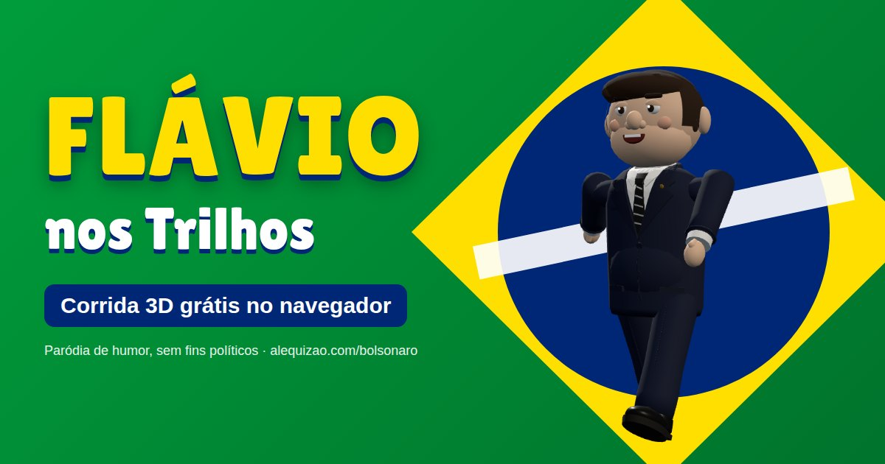
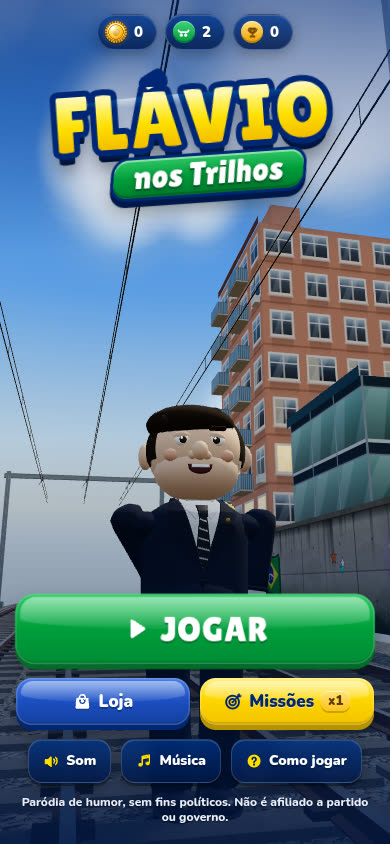
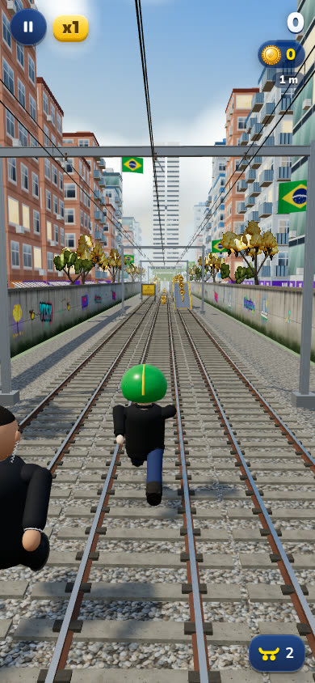
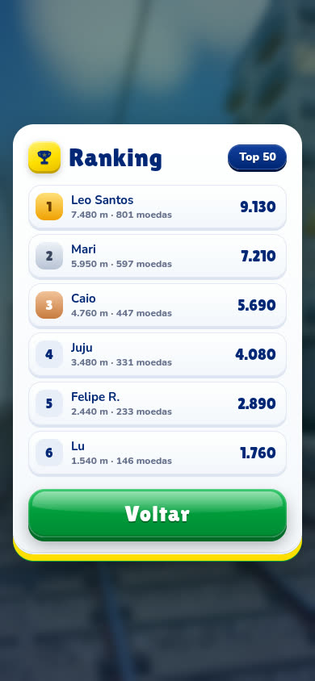
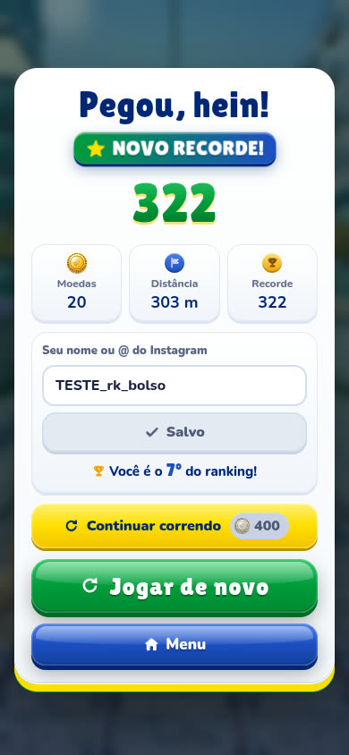
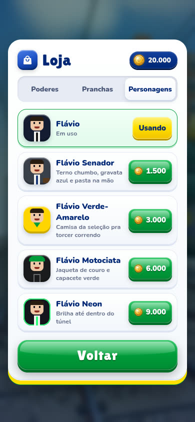
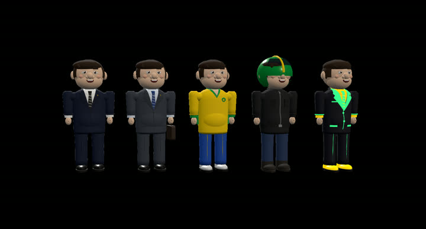
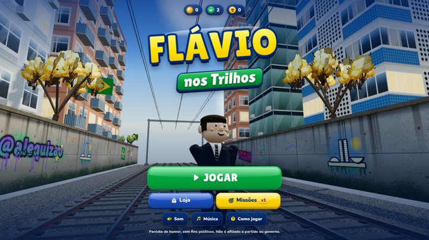
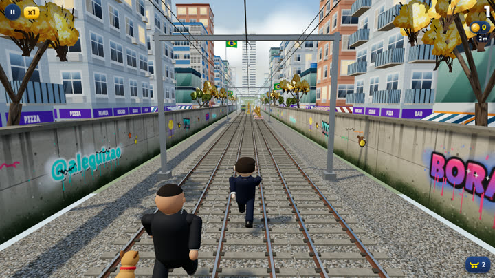

# 🇧🇷 Flávio nos Trilhos — jogo de corrida infinita 3D no navegador

[](https://alequizao.com/bolsonaro/)


**Flávio nos Trilhos** é uma paródia bem-humorada em forma de jogo de corrida infinita (*endless runner*) 3D, no estilo Subway Surfers, que roda direto no navegador do celular ou do computador — sem instalar, sem cadastro e de graça. O Flávio, de terno azul-marinho e gravata listrada, corre pelos trilhos, desvia dos trens, pega moedas e poderes e foge do segurança.

👉 **Jogue em: [alequizao.com/bolsonaro](https://alequizao.com/bolsonaro/)**

<p align="center"></p>

> Paródia de humor, sem fins políticos. Não é afiliado a partido ou governo.

## 📸 Telas do jogo

| Menu | Corrida |
|:---:|:---:|
|  |  |
| **Ranking online** | **Salvar no ranking** |
|  |  |

<details>
<summary><b>Mais telas</b> (loja, visuais, desktop)</summary>

| Loja | Visuais do Flávio |
|:---:|:---:|
|  |  |



</details>

## 🎮 Como jogar

| Ação | Celular | Teclado |
|---|---|---|
| Trocar de trilho | deslizar para os lados | ← → / A D |
| Pular | deslizar para cima | ↑ / W / Espaço |
| Rolar (no ar: descer rápido) | deslizar para baixo | ↓ / S |
| Usar prancha (aguenta uma batida) | toque duplo | B / Shift |
| Pausar | botão ❚❚ | Esc / P |

## ✨ Recursos

- **Ranking online:** ao perder, a pessoa salva o placar com o nome ou o @ do Instagram e vê a posição; top 50 no menu (PHP + SQLite, com validação e limite de envios).
- **Pista sempre com saída:** o gerador simula os trilhos à frente e só coloca um trem ou tapume se ainda houver caminho — inclusive contando o trem na contramão.
- **Continuar sempre:** com 400 moedas dá para continuar a corrida quantas vezes quiser.
- **Personagem Flávio em 3D:** cabelo escuro penteado de lado, sem barba, terno azul-marinho, camisa branca e gravata listrada.
- **Visuais na loja:** Flávio, Flávio Senador, Flávio Verde-Amarelo, Flávio Motociata e Flávio Neon.
- **Poderes:** Ímã de Moedas, Jatinho, Tênis Mola e Motociata 2x — com níveis na loja.
- **Obstáculos:** trens parados e na contramão, barreiras, placas para rolar, rampas para correr em cima dos vagões.
- **Segurança** na perseguição quando você tropeça.
- **Missões** com multiplicador de pontos permanente.
- **Som e trilha** sintetizados com WebAudio.
- **PWA:** instala como app e funciona offline.
- **Qualidade adaptativa** para aparelhos mais fracos.

## 🛠️ Tecnologia

- [Three.js](https://threejs.org/) r170 (WebGL), sem build — ES modules puros.
- Texturas desenhadas por código (canvas).
- Service worker com cache versionado.

| Arquivo | O que faz |
|---|---|
| `index.html` | telas, HUD, sprite de ícones SVG, SEO |
| `jogo.js` | regras, física, pista, cenário, câmera, loja, missões, áudio |
| `personagens.js` | Flávio e segurança |
| `objetos.js` | trens, rampa e obstáculos |
| `itens.js` | moedas e poderes |
| `icones.js` | helper dos ícones SVG |
| `ranking.js` / `ranking.php` | ranking online (tela, envio e API com SQLite fora da pasta pública) |
| `estilo.css` | interface |
| `sw.js` / `manifest.webmanifest` | PWA offline |

### Rodar localmente

```bash
git clone https://github.com/alequizao/flavio-nos-trilhos.git
cd flavio-nos-trilhos
python3 -m http.server 8080
# abra http://localhost:8080
```

O ranking precisa de PHP 7.4+ com `pdo_sqlite`: ajuste `PASTA_DADOS` em `ranking.php` para uma pasta fora do alcance da web (o banco e o segredo do hash de IP são criados sozinhos).

> A cada publicação, suba a versão (`?v=`) em `index.html`, nos `import` dos módulos, em `sw.js` (`VERSAO` e lista) e em `jogo.js`.

Veja também: [Surf nos Trilhos](https://github.com/alequizao/surf-nos-trilhos), o jogo original, e [Lula nos Trilhos](https://github.com/alequizao/lula-nos-trilhos).

## 👨‍💻 Desenvolvedor

Jogo desenvolvido por **Alequizao**.

- **E-mail:** alequizao.dev@gmail.com
- **Instagram:** [@alequizao](https://instagram.com/alequizao)
- **GitHub:** [@alequizao](https://github.com/alequizao)
- **Site:** [alequizao.com](https://alequizao.com/)

Quer um jogo ou sistema como este? Entre em contato.

---

© 2026 Alequizao · Todos os direitos reservados. Paródia de humor, sem fins políticos e sem relação com partidos ou governos, Subway Surfers ou SYBO.
Uso, cópia ou redistribuição somente com autorização. Three.js é distribuído sob a licença MIT pelos seus autores.
